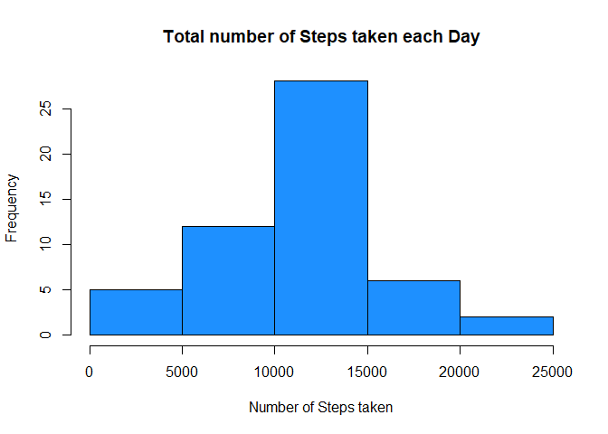
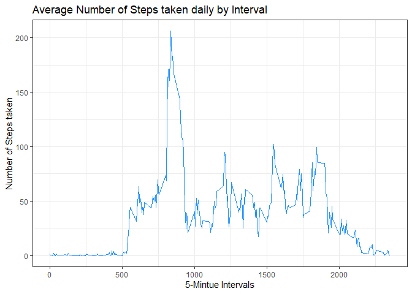
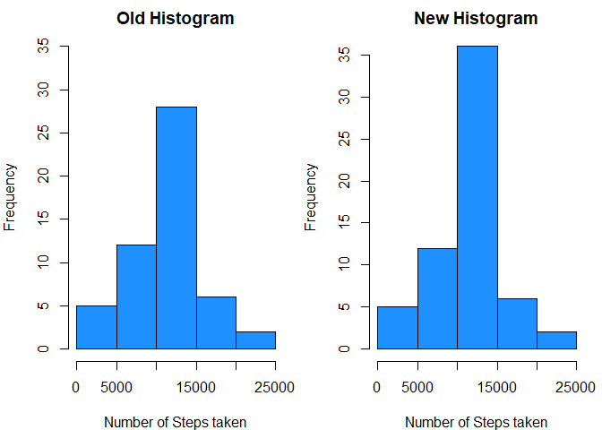
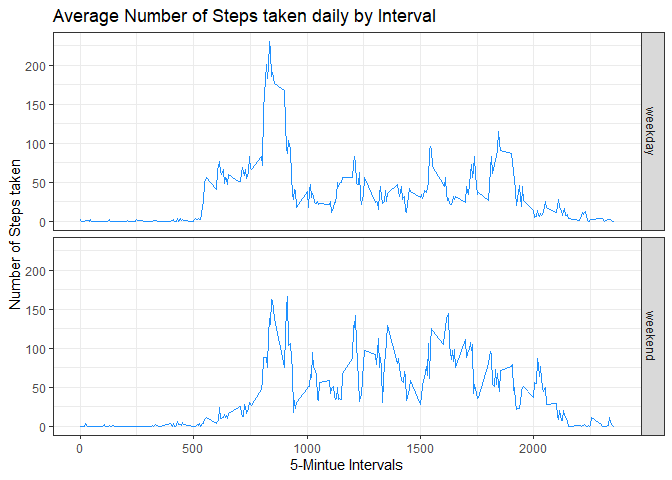

## Loading and preprocessing the data


```r
if(!file.exists("activity.csv")){
        url <- 'http://d396qusza40orc.cloudfront.net/repdata%2Fdata%2Factivity.zip'
        download.file(url,destfile='repdatadataFactivity.zip')
        unzip('repdatadataFactivity.zip')}
data <- read.csv("activity.csv")
# to check whether if the data are completely loaded with 17568 observations
# and get an idea of preprocessing
str(data)
```

```
## 'data.frame':	17568 obs. of  3 variables:
##  $ steps   : int  NA NA NA NA NA NA NA NA NA NA ...
##  $ date    : Factor w/ 61 levels "2012-10-01","2012-10-02",..: 1 1 1 1 1 1 1 1 1 1 ...
##  $ interval: int  0 5 10 15 20 25 30 35 40 45 ...
```

## What is mean total number of steps taken per day?


```r
stepsperday <- aggregate(steps ~ date, data, sum)
hist(stepsperday$steps, col = "dodgerblue", xlab = "Number of Steps taken", main = "Total number of Steps taken each Day")
```

<!-- -->

```r
mean(stepsperday$steps)
```

```
## [1] 10766.19
```

```r
median(stepsperday$steps)
```

```
## [1] 10765
```

## What is the average daily activity pattern?

```r
library("ggplot2")
stepsperinterval <- aggregate(steps ~ interval, data ,mean)
ggplot(stepsperinterval, aes(interval,steps))+
        geom_line(col = "dodgerblue") +
        xlab("5-Mintue Intervals") +
        ylab("Number of Steps taken") +
        ggtitle("Average Number of Steps taken daily by Interval") +
        theme_bw()
```

<!-- -->

```r
stepsperinterval[grepl(max(stepsperinterval$steps),stepsperinterval$steps),1]
```

```
## [1] 835
```

## Imputing missing values


```r
sum(!complete.cases(data))
```

```
## [1] 2304
```

## A Hint: in this case you cannot fill NAs by mean steps of date.
## Since there are some days contain only NAs, eg.2012-10-01


```r
filldata <- aggregate(steps ~ interval, data, mean) 
for(i in 1:nrow(data)){
        fillrow <- data[i,]
        if(is.na(fillrow$steps)){
                fillset <- subset(filldata, filldata$interval == fillrow$interval)
                fillrow$steps <- fillset$steps
        }
        data[i,1] <- fillrow$steps
}
newdata <- data
#check if there is still NAs
sum(!complete.cases(newdata))
```

```
## [1] 0
```

```r
sumbyday <- aggregate(steps ~ date, newdata, sum)
par(mfrow=c(1,2),mar=c(4,4,2,1))
hist(stepsperday$steps, col = "dodgerblue", xlab = "Number of Steps taken", main = "Old Histogram",ylim = c(0,35))
hist(sumbyday$steps, col = "dodgerblue", xlab = "Number of Steps taken", main = "New Histogram")
```

<!-- -->

```r
mean(sumbyday$steps)
```

```
## [1] 10766.19
```

```r
median(sumbyday$steps)
```

```
## [1] 10766.19
```

## Recall that the mean and median without inputing NAs are:


```r
mean(stepsperday$steps)
```

```
## [1] 10766.19
```

```r
median(stepsperday$steps)
```

```
## [1] 10765
```

## It is clear from both the histograms and values that the median has INCREASED without NAs!

## The variation is obvious in the frequency of steps between 10000 and 15000, INCREASED too!

## Are there differences in activity patterns between weekdays and weekends?


```r
newdata[,"day"] <- NA
weekday <- c("Monday", "Tuesday", "Wednesday", "Thursday", "Friday")
for (i in 1:nrow(newdata)){
        row <- newdata[i,]
        if(weekdays(as.Date(row$date)) %in% weekday){
                newdata[i,]$day <- "weekday"
        }
        else{
                newdata[i,]$day <- "weekend"
        }
} 
newaverage <- aggregate(steps ~ interval + day, newdata, mean)
ggplot(newaverage, aes(interval, steps)) + 
        facet_grid(rows = vars(day))+
        geom_line(col = "dodgerblue") +
        xlab("5-Mintue Intervals") +
        ylab("Number of Steps taken") +
        ggtitle("Average Number of Steps taken daily by Interval") +
        theme_bw()
```

<!-- -->
        

